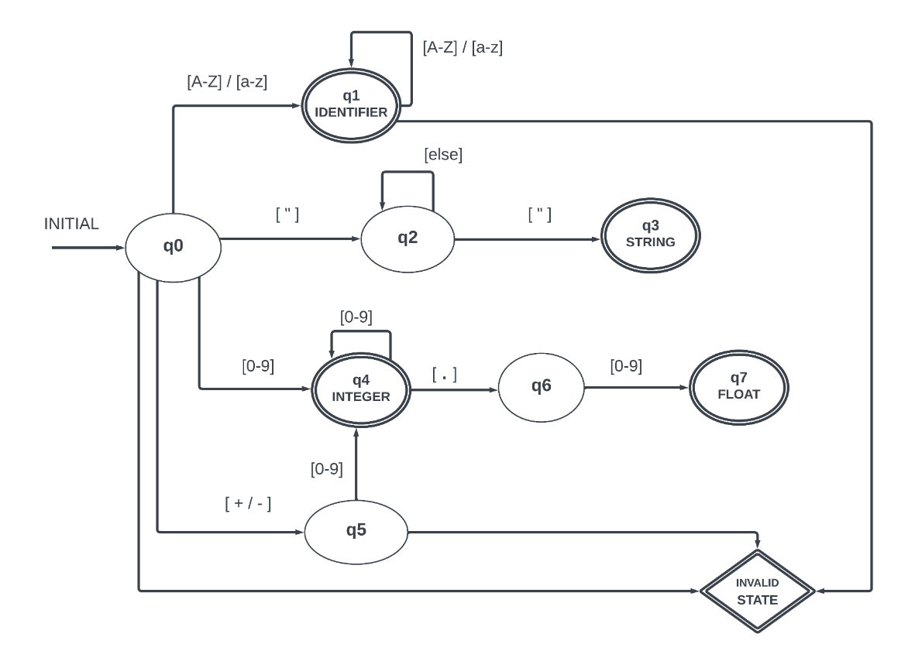

# Lexiccal-Analyzer

**`Lexical Analysis`** is one of three phases that any compiler should go through to compile any high level code i.e, programming languages that can be understand by a computer.  
The other two phases are **`Syntax Analysis`** and **`Semantic Analysis`**.  
The main job of Lexical Analyzer is to separate the code into lexemes, Then classify them using Token classification like **(Keywords, Special Symbols, Idnetifiers, Operators)**. 
The output is a table containing the lexemes and their tokens, also the Lexical errors or invalid code could be captured. 

## Available Tokens
<table>
<tr><td> IDENTIFIER <td> STRING  <td> INTEGER <td> FLOAT  <td> PLUS
<tr><td> MINUS  <td> TIMES  <td> DIVIDE  <td> KEYWORD  <td> INVALID
<tr><td> SEMICOLON  <td> LEFT_PARENTHESIS  <td> RIGHT_PARENTHESIS  <td> LEFT_BRACE <td> RIGHT_BRACE 
<tr><td> COMMA  <td> DOT  <td> COLON  <td> EQUAL <td> LOWER_OR_EQUALS 
<tr><td> GREATER_OR_EQUALS <td> NOT_EQUALS  <td> GREATER_THAN  <td> LOWER_THAN  <td> AT_SIGN </td>
</table>
 

## The machine diagrame

